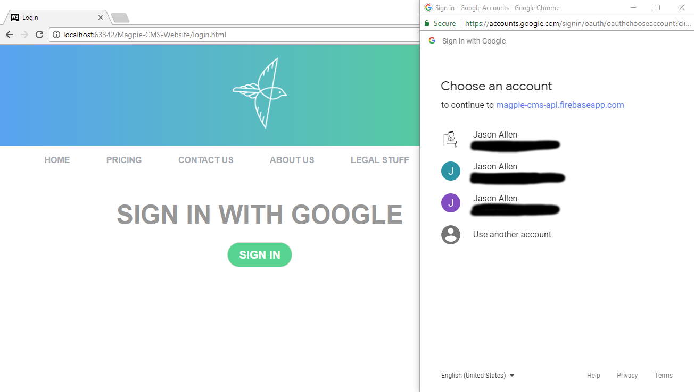
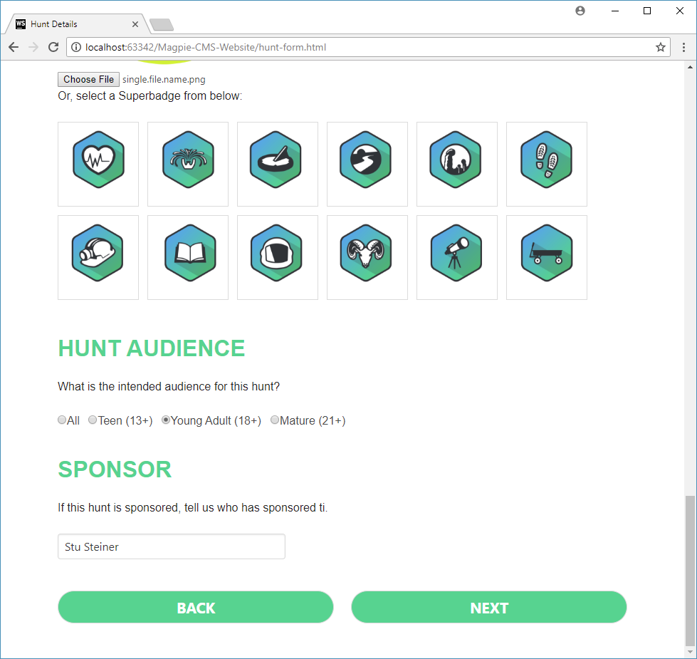
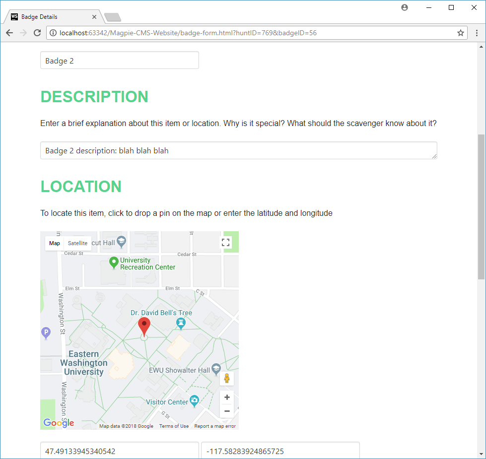
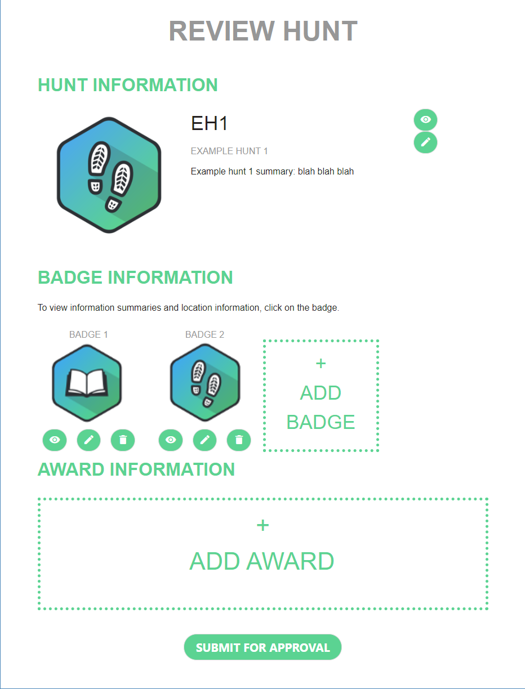
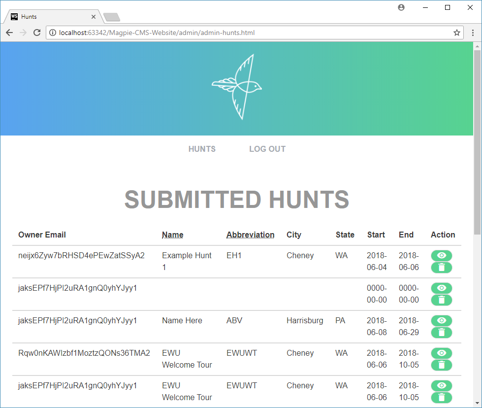
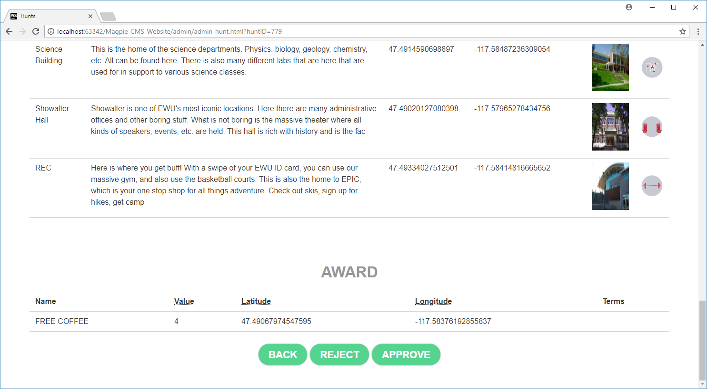

# Magpie-CMS-Website

Magpie is a content management system for creating and hosting scavenger hunts. Creators can create a hunt on the Magpie website which will be stored on the server. Players can then download and participate in these hunts by using the Magpie mobile app. The goal of Magpie to provide educational and commercial scavenger hunts that are engaging with the community.

This Magpie CMS Website is an independent website for the creation, managing, and deletion of hunts in the CMS backend. This website frontend is built to work with the [Magpie-CMS-API](https://github.com/rkwitz/Magpie-CMS-API) codebase. The site relies purely on the API and can be ran separately from the backend server.

### Sections
 - [User Guide](#user-guide)
 
 - [Admin Guid](#admin-guide)

 - [Development](#development)

### User Guide
The starting page is the index.html file for the website. Standard information for the website is provided on the web page. The login page will allow the user to log in with a Google account or a regular email depending on how the Google Firebase authentication is configured. If the user is already signed in, the user will automatically redirected to the next page.

The signed in homepage allows for quick access to create a new hunt or the navigation bar on the top allows for access to all pages. Clicking on `create` will display a page with input fields that should be populated to create a new hunt. Uploaded or select a super badge for the before hitting next to create the hunt. It will then dump the user onto the hunt review page to creating and delete parts of the the hunt.

Creating a badge is a similar process to creating a hunt. Fill out all the fields and upload images for the landmark and badge icon before clicking save to add the badge to the current hunt. If the save button does not work, check for any pop up alerts regarding the issue and make sure the fields are filled out.

Award is the last thing that can be added to the hunt but is not required. To add one, click the create new award at the bottom of the hunt review page. It is similar to creating a badge. Fill out the fields and provide a location via the Google map. Hit save at the bottom to save the award to the hunt.

The review hunt page allows for creating and deleting badges and the award. At the bottom of the page is the option to submit the hunt for review. This will place the hunt under review for the admin to approve from their web portal. If the hunt is under review or published, the hunt is still viewable but can not be edited. 

The my hunts page serves to view all the hunts the particular user has, see the state they are in, and access them. A hunt can be deleted from the my hunts page at any state the hunt might be in. Be careful as deleting a hunt can not be undone and will prevent people from downloading or finishing hunts in progress.

### Admin Guide
The admin login page is located at `/admin/admin-login.html`. It uses the same login code as the creator login. The user will have to be manually flagged in the database as a admin in the users table for them to be permitted to access and use the admin pages.

After logging in, the admin page will list the pending and approved hunts. All the hunts can be view in more detail or delete from this page. The admin is in charge of making sure the hunts do not violate any of the policies and do not trespass onto private property. The all hunts section has hunts that are waiting to be approved in the submitted hunts and approved hunts in the section below.

Clicking the eye icon next the hunt will view that hunt in more detail. In that view, details of that hunt are displayed (hunt, badges, & award). At the bottom are buttons to reject and approve the hunt. Choose to approve or reject the hunt based on the quality of the hunt content displayed above.

### Development
The development can be done in notepad++ to WebStorm. It doesn't really matter since it is straight HTML and JavaScript. There are no frameworks required for these pages but could be refactor to incorporate them if their functionality is expanded.

The pages are laid out with `name.html` corresponding to `./js/name.js` file for the corresponding functionality of that page. All the pages have the `master.js` embedded with them. Most pages also have the `firebase-utils.js` included since they handle authentication for all API requests and redirecting to the login if the user is not logged in. Please note that the import order of the JS files does matter for some code like the `firebase-utils.js`.

Because there are no backend controllers for these pages, all the page logic is controlled by the JavaScript files. Those files check and respond depending on the state of the hunt for certain pages. This also mean no page can be blocked by the backend since there isn't a controller to it. The page will redirect the user to the login but it can be overridden. Even if they get to those unauthorized pages, they will not work because the API will check the permissions of the user and the state of the hunt.
