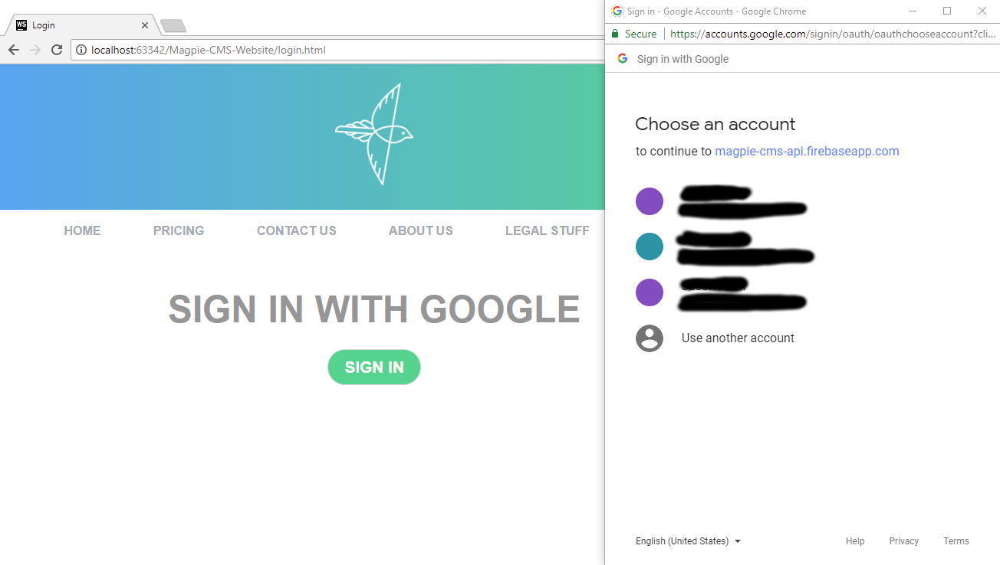

# Magpie-CMS-Website

Magpie CMS Website is an independent website for the creation, managing, and deletion of hunts in the CMS backend. This website frontend is built to work with the [Magpie-PHP](https://github.com/rkwitz/magpie-php) codebase. The site relies purely on the API and can be ran separately from the backend server.

### Sections
[User Guide](#User Guide)

dev environment

code structure

### User Guide
The starting page is the index.html page for the website. Standard information for the website is provided on the web page. The login page will allow the user to log in with a Google account or a regular email depending on how the Google Firebase authentication is configured. If the user is already signed in, the user will automatically redirected to the next page.

The signed in homepage allows for quick access to create a new hunt or the navigation bar on the top allows for access to all pages. Clicking on `create` will display a page with input fields that should be populated to create a new hunt. Uploaded or select a super badge for the before hitting next to create the hunt. It will then dump the user onto the hunt review page to creating and delete parts of the the hunt.

Creating a badge is a similar process to creating a hunt. Fill out all the fields and upload images for the landmark and badge icon before clicking save to add the badge to the current hunt. 

Award is the last thing that can be added to the hunt but is not required. To add one, click the create new award at the bottom of the hunt review page. It is similar to creating a badge. Fill out the fields and provide a location via the Google map. Hit save at the bottom to save the award to the hunt.

The review hunt page allows for creating and deleting badges and the award. At the bottom of the page is the option to submit the hunt for review. This will place the hunt under review for the admin to approve from their web portal. If the hunt is under review or published, the hunt is still viewable but can not be edited. 

The my hunts page serves to view all the hunts the particular user has, see the state they are in, and access them. A hunt can be deleted from the my hunts page at any state the hunt might be in.

### Admin Guide
The admin pages are not implemented but would work as the following: The admin login page is located at `/admin/admin-login.html`. It uses the same login code as the creator login so the user will have to be manually flagged in the database as a admin in the users table.

After logging in, the admin page will list the pending, approved, and reject hunts. All the hunts can be view in more detail or delete from this page. The all hunts section has hunts that are waiting to be approved with the check mark box.

### Development
The development can be done in notepad to WebStorm. It doesn't really matter since it is just HTML and JavaScript. There are no frameworks required for these pages but could be refactor to incorporate them if their functionality is expanded.

The pages are laid out with `name.html` corresponding to `name.js` file for the corresponding functionality of that page. All the pages have the `master.js` embedded with them. Most pages also have the `firebase-utils.js` included since they handle authentication for all API requests and redirecting to the login if the user is not logged in.

Because there are no backend controllers for these pages, all the page logic is controlled by the JavaScript files. Those files check and respond depending on the state of the hunt for certain pages. This also mean no page can be blocked by the backend since there isn't a controller to it. The page will redirect the user to the login but it can be disabled. Even if they get to those unauthorized pages, they will not work because the API will check the permission level of the user.